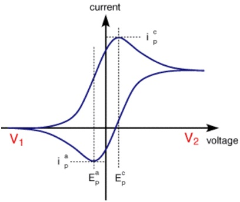

Cyclic Voltammetry is an electrochemical technique that is used to study the oxidation and reduction reactions of molecular species. It is also useful in depicting electron transfer in catalytic reactions. It measures the amount of current (I) with respect to varying potential (V).  A voltammogram is defined as a plot observed between the charge in current with the varying voltage. For an electrode, a minimum potential is required to initiate a reduction or oxidation reaction.

A typical voltammogram of a reversible redox couple exhibits a pair of well-defined oxidation and reduction peaks, where the anodic peak corresponds to oxidation, and the cathodic peak represents reduction of the electroactive species. The separation between these two peaks (ΔEp) is a key indicator of reversibility—smaller peak separation signifies fast electron transfer and a more reversible system. Additionally, the peak current is directly proportional to the square root of the scan rate, confirming diffusion-controlled behaviour.

The ferricyanide/ferrocyanide redox system is selected for this study due to its well-established, reversible one-electron transfer mechanism, high electrochemical stability, and rapid electron-exchange kinetics. This makes it an ideal standard couple for evaluating instrument response, electrode performance, and understanding CV fundamentals. The voltammogram obtained clearly illustrates the forward oxidation peak (Fe(CN)₆⁴⁻ → Fe(CN)₆³⁻ + e⁻) and the corresponding reverse reduction peak on the return sweep, enabling interpretation of electron transfer dynamics. An annotated diagram is provided to highlight peak positions,redox transitions, and potential scan direction for better understanding of the electrochemical process. 

### Voltammetric cell comprises of three electrodes system:
	
<table>
	<thead>
  <tr>
    <th>S.No.</th>
    <th>Working Electrode </th>
    <th>Auxiliary electrode (Counter) 
</th>
<th>Reference electrode 
</th>
  </tr>
  </thead>
  <tbody>
  <tr>
    <td>1.</td>
    <td>Various geometries &amp; material from small Hg drops to flat Pt disks </td>
    <td>Passes all the current needed to balance the current observed at the working electrode </td>
	    <td>Give information about reversible half reaction. E.g. Calomel electrode </td>
  </tr>
  <tr>
    <td>2.</td>
    <td>Mainly used materials Au, Pt, Glassy carbon electrode</td>
    <td>
	</td>
	    <td>Measuring &amp; controlling of working electrode potential.</td>
  </tr>
</tbody>
</table>

