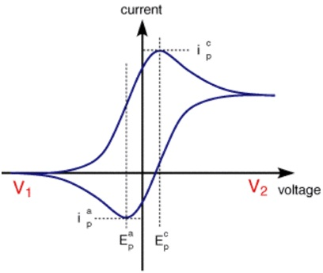

### Cyclic Voltammetry:

It is an electrochemical technique which is used to study the oxidation and reduction reactions of molecular species. It is also useful in depicting 
electron transfer in catalysis reactions. It measures the amount of current (I) with respect to varying potential (V).
Voltammogram: It is defined as a plot observed between the charge in current with the varying voltage. For an electrode, minimum potential is required to 
initiate reduction or oxidation reaction.

### Voltammetric cell comprises of three electrodes system:
	
<table>
	<thead>
  <tr>
    <th>S.No.</th>
    <th>Working Electrode </th>
    <th>Auxiliary electrode (Counter) 
</th>
<th>Reference electrode 
</th>
  </tr>
  </thead>
  <tbody>
  <tr>
    <td>1.</td>
    <td>Various geometries &amp; material from small Hg drops to flat Pt disks </td>
    <td>Passes all the current needed to balance the current observed at the working electrode </td>
	    <td>Give information about reversible half reaction. E.g. Calomel electrode </td>
  </tr>
  <tr>
    <td>2.</td>
    <td>Mainly used materials Au, Pt, Glassy carbon electrode</td>
    <td>
	</td>
	    <td>Measuring &amp; controlling of working electrode potential.</td>
  </tr>
</tbody>
</table>

